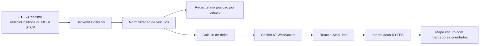

# STCP Live Tracker

Estrutura inicial de uma aplicacao web/mobile-first para monitorizacao em tempo real de autocarros da STCP, estilo Uber/Flightradar24.

## Arquitetura



## Estrutura de ficheiros

```txt
stcp-live-tracker/
  apps/
    backend/
      src/
        cache/redisStore.ts
        feeds/gtfsRealtimeFeed.ts
        feeds/mockFeed.ts
        services/gtfsStopsService.ts
        realtime/socketHub.ts
        services/vehiclePollingService.ts
        config.ts
        index.ts
        types.ts
    frontend/
      src/
        components/BusMap.tsx
        geo/lerp.ts
        realtime/socket.ts
        App.tsx
        main.tsx
        styles.css
        types.ts
  docker-compose.yml
  .env.example
```

## Como correr localmente

1. Instalar Node.js 20+ e pnpm.
2. Copiar `.env.example` para `.env` na raiz. Por defeito, `FEED_SOURCE=ngsi` usa a fonte publica FIWARE/Porto Digital.
3. Arrancar Redis:

```bash
docker compose up -d redis
```

4. Instalar dependencias:

```bash
pnpm install
```

5. Correr backend e frontend:

```bash
pnpm dev
```

6. Abrir o cliente:

```txt
http://localhost:5173
```

O backend fica em `http://localhost:4000`. Para usar dados simulados em torno do Porto, muda `FEED_SOURCE=mock`.

## Fonte real de dados

O portal Porto Digital lista dados estaticos GTFS da STCP e um dataset de localizacao em tempo real em formato NGSI/SmartDataModels. Esta base ja inclui um adapter NGSI em `apps/backend/src/feeds/ngsiVehicleFeed.ts`.

O backend consulta a fonte a cada 5 segundos para apanhar novas posicoes assim que forem publicadas. Se a fonte publica repetir os mesmos timestamps durante alguns segundos, o frontend continua a animar por previsao curta, mas nao inventa novas coordenadas reais.

Endpoint usado por defeito:

```txt
https://broker.fiware.urbanplatform.portodigital.pt/v2/entities?q=vehicleType==bus&limit=1000
```

Tambem existe suporte para `VehiclePositions` GTFS-Realtime via `FEED_SOURCE=gtfs-rt` e `GTFS_RT_VEHICLE_POSITIONS_URL`.

As paragens sao carregadas a partir do GTFS estatico oficial configurado em `GTFS_STATIC_URL` e expostas em `GET /stops` como GeoJSON.
