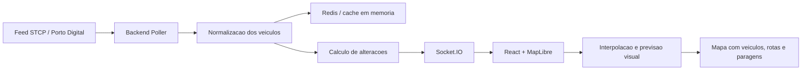

# InvictaGo

InvictaGo e uma web app em desenvolvimento focada em transportes publicos da Area Metropolitana do Porto. O objetivo e tornar mais simples acompanhar veiculos, consultar linhas/paragens e planear deslocacoes numa interface moderna, responsiva e orientada para uso diario em mobile e desktop.

Este projeto foi desenvolvido no ambito de um projeto universitario. Nao e uma aplicacao oficial da STCP, Metro do Porto, UNIR, Porto Digital ou de qualquer entidade publica/operadora.

## Estado atual

- **STCP**: componente principal do projeto e a parte mais completa neste momento. Inclui tracking em tempo real, mapa, linhas, paragens, favoritos, detalhes de veiculo e planeador de percurso.
- **Metro do Porto**: camada preparada e parcialmente estimada por horarios/GTFS. A integracao realtime real fica dependente da existencia de um endpoint publico e confiavel.
- **UNIR**: previsto como expansao futura para cobrir mais transportes da Area Metropolitana do Porto. Tal como no Metro, depende de acesso a dados publicos/endpoint adequado.

## Funcionalidades principais

- Mapa interativo com autocarros da STCP em tempo real.
- Movimento suave dos veiculos no mapa.
- Icones pequenos de autocarro com numero da linha.
- Rotacao dos veiculos com base no `bearing`.
- Pesquisa por linha, sentido/destino e paragem.
- Filtro rapido de linhas.
- Paragens clicaveis no mapa.
- Realce de rota e paragens da linha selecionada.
- Previsao estimada de chegada do proximo autocarro a uma paragem.
- Painel de detalhes ao selecionar autocarro ou paragem.
- Planeador de percurso com origem, destino, hora de partida/chegada e alternativas.
- Percursos a pe calculados pelas ruas, em vez de linhas retas.
- Atalhos mobile para Casa, Trabalho e destino Personalizado.
- Favoritos guardados localmente no dispositivo.
- Modo escuro e modo claro.
- Interface adaptada a desktop e mobile.

## Tecnologias utilizadas

### Frontend

- **React**: construcao da interface, componentes, paineis, pesquisa, pop-ups e estados da aplicacao.
- **TypeScript**: tipagem do codigo para reduzir erros e facilitar manutencao.
- **Vite**: servidor de desenvolvimento rapido e build de producao.
- **MapLibre GL JS**: renderizacao do mapa vetorial, autocarros, paragens, rotas e camadas interativas.
- **Socket.IO Client**: rececao das atualizacoes em tempo real enviadas pelo backend.
- **CSS puro**: layout, modo claro/escuro, responsividade e design mobile.
- **localStorage/sessionStorage**: armazenamento local de favoritos, atalhos e preferencias.

### Backend

- **Node.js**: runtime do servidor.
- **TypeScript**: tipagem e organizacao do backend.
- **Express**: API HTTP para veiculos, linhas, paragens, shapes e dados auxiliares.
- **Socket.IO**: comunicacao realtime por WebSocket.
- **Redis**: cache da ultima posicao conhecida de cada veiculo. Em desenvolvimento existe fallback em memoria caso o Redis nao esteja disponivel.
- **GTFS / GTFS-Realtime / NGSI**: formatos/fontes usados para linhas, paragens, shapes, horarios e posicoes.
- **OSRM**: calculo de percursos a pe pelas ruas.

### Ferramentas

- **pnpm**: gestao de dependencias e scripts do monorepo.
- **Git/GitHub**: controlo de versoes e colaboracao.
- **Docker Compose**: arranque local do Redis.

## Arquitetura geral



## Como funciona o realtime dos autocarros

O backend consulta a fonte de dados publica em intervalos regulares. Por defeito, `POLL_INTERVAL_MS` esta configurado para **5000 ms**, ou seja, o servidor tenta obter novas posicoes a cada **5 segundos**.

Em cada ciclo:

1. O backend consulta o feed de posicoes.
2. Normaliza dados como `vehicle_id`, linha, latitude, longitude, direcao, velocidade, proxima paragem e hora da ultima atualizacao.
3. Compara o novo estado com o estado guardado.
4. Atualiza a cache em Redis.
5. Envia para os clientes apenas o delta, ou seja, os veiculos que mudaram ou desapareceram.

Isto reduz trafego, evita enviar sempre todos os autocarros e permite que o mapa reaja rapidamente a novas posicoes.

## Suavidade e previsao visual

Os dados reais nao chegam a 60 FPS. Mesmo com polling a cada 5 segundos, cada veiculo pode ter atualizacoes menos frequentes, dependendo da fonte publica.

Para evitar saltos bruscos, o frontend:

1. Guarda a posicao anterior e a nova posicao.
2. Calcula a duracao da animacao com base no intervalo real entre timestamps GPS.
3. Interpola a posicao a cada frame.
4. Atualiza tambem a direcao visual do autocarro.

Quando existe shape GTFS confiavel para a linha/sentido, o autocarro e projetado para essa rota e desloca-se visualmente ao longo dela. Assim, sempre que possivel, o veiculo segue o percurso da linha em vez de atravessar o mapa em linha reta.

Se ainda nao chegaram dados novos, a app faz uma previsao curta:

- usa a velocidade recebida no feed;
- limita a velocidade a um valor razoavel para cidade;
- limita o tempo de previsao para o veiculo nao fugir da realidade;
- para a previsao se o GPS estiver muito antigo, se a velocidade for baixa ou se o autocarro estiver longe da rota.

Assim, o mapa fica fluido, mas continua honesto: a previsao e apenas visual e nao substitui uma nova posicao real confirmada.

## Planeador de percurso

O planeador permite escolher origem, destino e hora de partida/chegada. No mobile existem atalhos para Casa, Trabalho e um destino Personalizado.

Os percursos a pe sao calculados com OSRM, para seguirem ruas reais em vez de linhas retas. As opcoes de transporte usam as linhas/paragens disponiveis no GTFS e tentam apresentar alternativas por tempo total, numero de transfers e tempo a pe.

## Privacidade

Nesta fase nao existem contas de utilizador nem sincronizacao entre dispositivos.

Os dados pessoais simples ficam guardados apenas no browser do utilizador:

- favoritos;
- modo claro/escuro;
- atalhos Casa, Trabalho e Personalizado.

A localizacao do utilizador e pedida pelo browser para calcular percursos e encontrar paragens proximas. A aplicacao nao guarda essa localizacao como perfil de utilizador no backend.

## Limitacoes conhecidas

- A precisao depende da frequencia e qualidade das fontes publicas.
- Alguns veiculos podem atualizar com atraso ou ficar temporariamente parados.
- A previsao visual entre atualizacoes nao e uma posicao GPS confirmada.
- O Metro do Porto esta em modo estimado ate existir endpoint publico realtime confiavel.
- A integracao UNIR esta prevista, mas depende da disponibilidade de dados.
- Favoritos e atalhos ficam apenas no dispositivo onde foram guardados.
- O planeador e uma aproximacao e pode nao cobrir todos os cenarios reais de operacao.

## Estrutura do projeto

```txt
stcp-live-tracker/
  apps/
    backend/
      src/
        cache/
        feeds/
        realtime/
        services/
        config.ts
        index.ts
        types.ts
    frontend/
      src/
        components/
        data/
        geo/
        realtime/
        App.tsx
        main.tsx
        styles.css
  docker-compose.yml
  .env.example
  package.json
  pnpm-workspace.yaml
```

## Como correr localmente

1. Instalar **Node.js 20+** e **pnpm**.

2. Copiar `.env.example` para `.env` na raiz do projeto.

3. Arrancar Redis:

```bash
docker compose up -d redis
```

4. Instalar dependencias:

```bash
pnpm install
```

5. Correr backend e frontend:

```bash
pnpm dev
```

6. Abrir a aplicacao:

```txt
http://localhost:3001
```

O backend fica disponivel em:

```txt
http://localhost:4000
```

## Variaveis de ambiente

| Variavel | Funcao | Valor por defeito |
| --- | --- | --- |
| `PORT` | Porta do backend | `4000` |
| `REDIS_URL` | URL de ligacao ao Redis | `redis://localhost:6379` |
| `POLL_INTERVAL_MS` | Intervalo de polling dos veiculos | `5000` |
| `STALE_AFTER_SECONDS` | Tempo ate remover veiculos desaparecidos | `180` |
| `FEED_SOURCE` | Fonte dos veiculos: `ngsi`, `gtfs-rt` ou `mock` | `ngsi` |
| `NGSI_VEHICLE_POSITIONS_URL` | Endpoint NGSI/Porto Digital | Fonte publica Porto Digital |
| `GTFS_STATIC_URL` | Feed GTFS estatico da STCP | Fonte publica configurada |
| `METRO_GTFS_STATIC_URL` | Feed GTFS estatico do Metro do Porto | Fonte publica configurada |
| `GTFS_RT_VEHICLE_POSITIONS_URL` | Endpoint GTFS-Realtime, se usado | vazio |
| `GTFS_RT_AUTH_HEADER` | Header de autenticacao GTFS-RT, se necessario | vazio |

## Scripts

```bash
pnpm dev
```

Arranca backend e frontend em desenvolvimento.

```bash
pnpm build
```

Compila todos os pacotes.

```bash
pnpm typecheck
```

Verifica os tipos TypeScript.

## Roadmap

- Melhorar previsoes de chegada por paragem.
- Adicionar notificacoes quando um autocarro estiver a chegar.
- Evoluir para PWA instalavel.
- Integrar realtime do Metro do Porto quando existir endpoint confiavel.
- Adicionar suporte a UNIR quando existirem dados publicos adequados.
- Melhorar transfers entre STCP, Metro e futuros operadores.
- Adicionar sincronizacao opcional de favoritos entre dispositivos.
- Otimizar performance e bundle frontend.

## Contribuicao

Fluxo recomendado:

1. Criar uma branch a partir do branch principal.
2. Implementar a alteracao.
3. Testar com `pnpm dev`.
4. Validar com `pnpm build`.
5. Fazer commit e abrir pull request.

```bash
git checkout -b feature/nome-da-funcionalidade
pnpm dev
pnpm build
git add .
git commit -m "adiciona nome da funcionalidade"
git push -u origin feature/nome-da-funcionalidade
```

## Creditos e fontes

- STCP, Metro do Porto, UNIR e Porto Digital, quando os dados estiverem disponiveis publicamente.
- OpenStreetMap e ecossistema MapLibre para mapas e dados geograficos.
- OSRM para routing pedonal.
- MapLibre GL JS para renderizacao do mapa.

Este projeto nao substitui informacao oficial das operadoras.

## Licenca

Projeto academico em desenvolvimento. Pode ser adicionada uma licenca aberta, como MIT, caso o objetivo seja permitir reutilizacao e contribuicoes externas.
