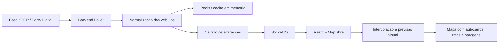

# InvictaGo - STCP Live Tracking em Tempo Real

Aplicacao web/mobile-first para acompanhar autocarros da STCP no Porto em tempo real, com uma experiencia inspirada em apps como Uber e Flightradar24: mapa interativo, veiculos em movimento, linhas, paragens, favoritos, planeador de percurso e vista adaptada a desktop/mobile.

## Estado do projeto

Este projeto encontra-se em desenvolvimento e foi criado no ambito de um projeto academico.

Nao e uma aplicacao oficial da STCP, Metro do Porto, Porto Digital ou de qualquer entidade publica/operadora. Os dados apresentados dependem de fontes publicas e podem sofrer atrasos, falhas temporarias ou diferencas face ao estado real da rede.

## Funcionalidades principais

- Mapa interativo com autocarros da STCP em tempo real.
- Movimento suave dos veiculos com interpolacao visual.
- Icones pequenos de autocarro com numero da linha e cor associada.
- Rotacao dos autocarros com base no `bearing`.
- Pesquisa por linha, destino/sentido e paragem.
- Filtro rapido de linhas.
- Paragens no mapa com destaque da linha selecionada.
- Clique em autocarros e paragens para ver informacao contextual.
- Estimativa de chegada do proximo autocarro a uma paragem.
- Realce da rota e das paragens de uma linha.
- Planeador de percurso com origem, destino, hora de partida/chegada e opcoes alternativas.
- Percursos a pe calculados por ruas com OSRM.
- Atalhos de destino no mobile: Casa, Trabalho e Personalizado.
- Favoritos de linhas/paragens guardados no dispositivo.
- Interface responsiva com vista desktop e mobile.
- Modo escuro e modo claro.
- Camada de Metro do Porto estimada por horarios, preparada para realtime quando existir feed publico confiavel.

## Tecnologias utilizadas

### Frontend

- **React**: construcao da interface da aplicacao, incluindo mapa, paineis, pesquisa, favoritos, percurso rapido e pop-ups.
- **TypeScript**: adiciona tipagem ao JavaScript para reduzir erros e tornar o codigo mais facil de manter.
- **Vite**: servidor de desenvolvimento rapido e ferramenta de build para gerar a versao final do frontend.
- **MapLibre GL JS**: motor do mapa vetorial usado para desenhar autocarros, paragens, linhas, trajetos e camadas interativas.
- **Socket.IO Client**: recebe atualizacoes em tempo real enviadas pelo backend.
- **CSS puro**: controla todo o design, incluindo modo escuro, modo claro, layout responsivo e interface mobile.
- **localStorage/sessionStorage**: guarda dados simples no dispositivo do utilizador, como favoritos, atalhos Casa/Trabalho/Personalizado e preferencias visuais.

### Backend

- **Node.js**: runtime usado para executar o servidor.
- **TypeScript**: torna o backend mais seguro e previsivel durante o desenvolvimento.
- **Express**: cria a API HTTP usada pelo frontend para consultar veiculos, linhas, paragens, shapes e dados auxiliares.
- **Socket.IO**: envia deltas de veiculos em tempo real para todos os clientes ligados.
- **Redis**: guarda a ultima posicao conhecida de cada autocarro. Se o Redis nao estiver disponivel em ambiente local, o projeto usa um fallback em memoria.
- **GTFS / GTFS-Realtime / NGSI**: formatos/fontes usados para linhas, paragens, shapes, horarios e posicoes dos veiculos.
- **OSRM**: usado no planeador para obter percursos a pe pelas ruas, em vez de linhas retas.

### Ferramentas

- **pnpm**: gestao de dependencias e scripts do monorepo.
- **Git/GitHub**: controlo de versoes e colaboracao.
- **Docker Compose**: arranque local do Redis.

## Arquitetura geral



## Como funciona o tracking dos autocarros

O backend consulta a fonte de dados em tempo real da STCP/Porto Digital em intervalos regulares. Por defeito, o `POLL_INTERVAL_MS` esta configurado para **5000 ms**, ou seja, o servidor tenta obter novas posicoes a cada **5 segundos**.

Em cada ciclo de polling, o backend:

1. Vai buscar as posicoes atuais dos autocarros.
2. Normaliza os dados principais: `vehicle_id`, linha, latitude, longitude, direcao, velocidade, proxima paragem e hora da ultima atualizacao.
3. Compara o estado novo com o estado anterior.
4. Guarda a ultima posicao no Redis.
5. Envia para o frontend apenas o delta, ou seja, os autocarros que mudaram ou desapareceram.

Isto evita reenviar todos os veiculos a toda a hora e torna a comunicacao mais leve.

## Suavidade do movimento no mapa

Os dados reais dos autocarros nao chegam a 60 FPS. Mesmo que o backend faca polling a cada 5 segundos, a fonte publica pode atualizar cada veiculo com intervalos maiores.

Para evitar que os autocarros "saltem" de uma posicao para outra, o frontend faz uma animacao entre a posicao anterior e a nova posicao recebida.

O processo e este:

1. O frontend recebe uma nova posicao por WebSocket.
2. Guarda a posicao anterior e a nova posicao.
3. Calcula a duracao da animacao com base no intervalo real entre timestamps GPS.
4. A cada frame, interpola a posicao do veiculo no mapa.
5. Atualiza tambem o `bearing`, para o icone apontar na direcao correta.

Quando existe informacao de rota/shapes GTFS para a linha, o movimento nao e feito simplesmente em linha reta. O veiculo e projetado para a geometria da rota e passa a deslocar-se sobre essa linha, o que ajuda a manter o autocarro visualmente em cima das ruas por onde a linha passa.

## O que acontece quando ainda nao chegaram novos dados

Quando uma nova posicao ainda nao chegou, a aplicacao evita inventar uma localizacao "real". Em vez disso, faz uma previsao visual curta para manter a experiencia fluida.

A previsao funciona assim:

- se o autocarro estiver bem alinhado com a rota, continua durante alguns segundos sobre o shape da linha;
- a velocidade usada vem do proprio feed, limitada a um valor razoavel para cidade;
- a previsao e curta, limitada no frontend, para nao deixar o autocarro fugir demasiado da posicao real;
- se o GPS estiver muito antigo, se a velocidade for muito baixa, ou se o veiculo estiver longe da rota, a previsao para e o autocarro fica na ultima posicao conhecida;
- veiculos com dados antigos podem perder destaque visual para indicar que a informacao ja nao e tao recente.

Assim, a app tenta equilibrar duas coisas importantes:

- **fluidez visual**, para o mapa parecer vivo;
- **honestidade dos dados**, para nao mostrar uma posicao falsa como se fosse confirmada.

## Rota seguida pelos autocarros

Sempre que possivel, o movimento usa os shapes GTFS da linha e do sentido do veiculo.

O frontend:

1. Procura a rota correspondente a linha e ao sentido.
2. Projeta a posicao GPS anterior e a nova posicao sobre essa geometria.
3. Interpola a distancia percorrida ao longo do shape.
4. Calcula o ponto final no mapa e o bearing com base na propria rota.

Se a posicao recebida estiver demasiado afastada da rota, ou se nao existir shape confiavel para aquela linha/sentido, a app usa fallback com interpolacao linear entre coordenadas GPS.

## Estrutura de ficheiros

```txt
stcp-live-tracker/
  apps/
    backend/
      src/
        cache/redisStore.ts
        feeds/gtfsRealtimeFeed.ts
        feeds/mockFeed.ts
        feeds/ngsiVehicleFeed.ts
        realtime/socketHub.ts
        services/vehiclePollingService.ts
        services/gtfsLinesService.ts
        services/gtfsStopsService.ts
        services/gtfsRouteShapesService.ts
        services/metroEstimatedVehiclesService.ts
        config.ts
        index.ts
        types.ts
    frontend/
      src/
        components/BusMap.tsx
        geo/lerp.ts
        realtime/socket.ts
        App.tsx
        main.tsx
        styles.css
        types.ts
  docker-compose.yml
  .env.example
  package.json
  pnpm-workspace.yaml
```

## Como correr localmente

1. Instalar **Node.js 20+** e **pnpm**.

2. Copiar `.env.example` para `.env` na raiz do projeto.

3. Arrancar Redis:

```bash
docker compose up -d redis
```

4. Instalar dependencias:

```bash
pnpm install
```

5. Correr backend e frontend:

```bash
pnpm dev
```

6. Abrir a aplicacao:

```txt
http://localhost:3001
```

O backend fica disponivel em:

```txt
http://localhost:4000
```

Para testar com dados simulados em torno do Porto, configurar:

```txt
FEED_SOURCE=mock
```

## Variaveis de ambiente

As principais variaveis configuraveis estao em `.env.example`.

| Variavel | Funcao | Valor por defeito |
| --- | --- | --- |
| `PORT` | Porta do backend | `4000` |
| `REDIS_URL` | URL de ligacao ao Redis | `redis://localhost:6379` |
| `POLL_INTERVAL_MS` | Intervalo de polling do feed de veiculos | `5000` |
| `STALE_AFTER_SECONDS` | Tempo ate remover veiculos desaparecidos do feed | `180` |
| `FEED_SOURCE` | Fonte de dados dos veiculos: `ngsi`, `gtfs-rt` ou `mock` | `ngsi` |
| `NGSI_VEHICLE_POSITIONS_URL` | Endpoint NGSI/Porto Digital para posicoes | Fonte publica Porto Digital |
| `GTFS_STATIC_URL` | Feed GTFS estatico da STCP | Fonte publica Porto Digital |
| `METRO_GTFS_STATIC_URL` | Feed GTFS estatico do Metro do Porto | Fonte publica configurada |
| `GTFS_RT_VEHICLE_POSITIONS_URL` | Endpoint GTFS-Realtime, quando usado | vazio |
| `GTFS_RT_AUTH_HEADER` | Header de autenticacao para GTFS-RT privado, se necessario | vazio |

## Scripts disponiveis

Na raiz do projeto:

```bash
pnpm dev
```

Arranca backend e frontend em modo desenvolvimento.

```bash
pnpm build
```

Compila todos os pacotes do monorepo.

```bash
pnpm typecheck
```

Verifica os tipos TypeScript.

Tambem e possivel correr cada app separadamente:

```bash
pnpm --filter @stcp-live/backend dev
pnpm --filter @stcp-live/frontend dev
```

## Fontes de dados

Por defeito, o projeto usa a fonte publica NGSI/Porto Digital para posicoes de autocarros:

```txt
https://broker.fiware.urbanplatform.portodigital.pt/v2/entities?q=vehicleType==bus&limit=1000
```

Tambem existe suporte para GTFS-Realtime `VehiclePositions` atraves de:

```txt
FEED_SOURCE=gtfs-rt
GTFS_RT_VEHICLE_POSITIONS_URL=...
```

As linhas, paragens e shapes sao carregados a partir de dados GTFS estaticos configurados em `GTFS_STATIC_URL`.

## Privacidade

Nesta fase nao existem contas de utilizador nem base de dados de perfis.

Dados como favoritos, modo claro/escuro e atalhos Casa/Trabalho/Personalizado ficam guardados localmente no browser do utilizador atraves de `localStorage` ou `sessionStorage`.

A localizacao do utilizador e pedida pelo browser para calcular percursos e encontrar paragens proximas. Essa informacao e usada no cliente para a experiencia de navegacao e nao e guardada como perfil de utilizador no backend.

## Limitacoes conhecidas

- A precisao dos autocarros depende da qualidade e frequencia da fonte publica.
- Alguns veiculos podem atualizar com atraso ou ficar temporariamente parados no mapa.
- A previsao visual entre atualizacoes e curta e serve apenas para melhorar a fluidez.
- Se um veiculo estiver longe da rota esperada, a app pode usar interpolacao GPS direta em vez do shape GTFS.
- O Metro do Porto e apresentado como camada estimada por horario, nao como posicao GPS real confirmada.
- Dados guardados no browser nao sincronizam entre dispositivos.
- Se o utilizador limpar os dados do browser, perde favoritos e atalhos locais.
- O planeador de percurso e uma aproximacao e pode nao cobrir todos os cenarios reais de operacao.

## Nota sobre precisao

Este projeto apresenta uma visualizacao em tempo real com interpolacao e previsao curta. A posicao confirmada depende sempre da ultima atualizacao recebida pela fonte de dados publica. Por isso, o movimento no mapa deve ser entendido como uma representacao visual aproximada do estado da rede, nao como localizacao GPS certificada segundo a segundo.

## Roadmap

- Melhorar o calculo de previsoes por paragem.
- Adicionar notificacoes/alertas quando um autocarro estiver a chegar.
- Transformar a aplicacao numa PWA instalavel.
- Sincronizar favoritos entre dispositivos com contas opcionais.
- Melhorar o planeador com mais operadores e transfers avancados.
- Integrar realtime real do Metro do Porto se existir uma fonte publica confiavel.
- Adicionar mais camadas de acessibilidade e informacao operacional.
- Otimizar o bundle frontend com code splitting.

## Contribuicao

Fluxo recomendado para colaborar:

1. Criar uma branch a partir do branch principal de desenvolvimento.
2. Implementar a alteracao de forma isolada.
3. Testar localmente com `pnpm dev` e validar com `pnpm build`.
4. Fazer commit com uma mensagem clara.
5. Abrir pull request para revisao antes de juntar ao `main`.

Exemplo:

```bash
git checkout -b feature/nome-da-funcionalidade
pnpm dev
pnpm build
git add .
git commit -m "adiciona nome da funcionalidade"
git push -u origin feature/nome-da-funcionalidade
```

## Creditos e fontes

- Dados de transporte publico: STCP, Metro do Porto e Porto Digital, quando disponiveis publicamente.
- Mapas e dados geograficos: OpenStreetMap e ecossistema MapLibre.
- Routing pedonal: OSRM.
- Biblioteca de mapa: MapLibre GL JS.

Este projeto nao representa nem substitui informacao oficial das operadoras.

## Licenca

Este repositorio pode usar uma licenca aberta, como MIT, caso o objetivo seja permitir estudo, reutilizacao e contribuicoes. Se for adicionada uma licenca formal, recomenda-se criar um ficheiro `LICENSE` na raiz do projeto.
